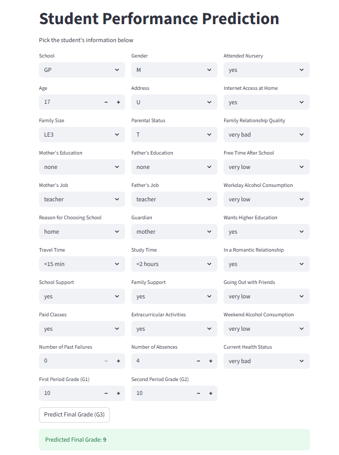
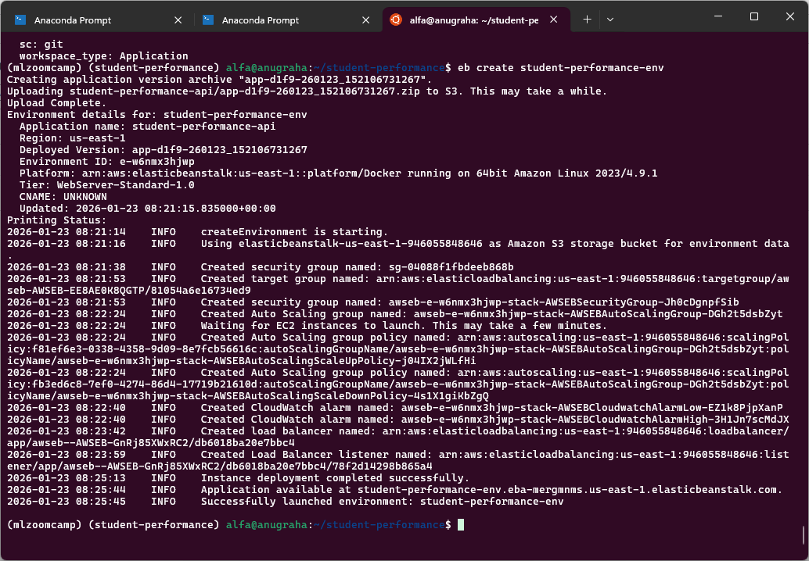
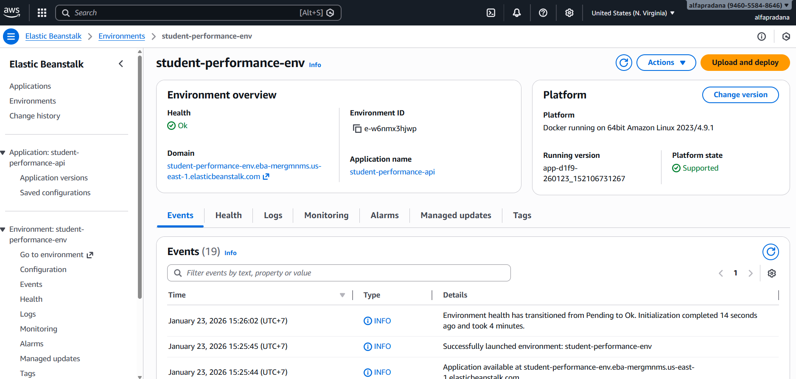

# Student Performance Project

## Project Overview

This repository contains the code and documentation for the student performance analysis project. The project utilizes the "Student Performance" dataset from the UCI Machine Learning Repository to analyze and predict student grades based on various features.

Cortez, P. (2008). Student Performance [Dataset]. UCI Machine Learning Repository. https://doi.org/10.24432/C5TG7T.

## Dataset

The dataset used in this project can be found at the UCI Machine Learning Repository: [Student Performance Data Set](https://archive.ics.uci.edu/dataset/320/student+performance). It contains various attributes related to student demographics, social and school-related features, and their grades.

Attributes for both `student-mat.csv` (Math course) and `student-por.csv` (Portuguese language course) datasets:

1. `school` - student's school (binary: "GP" - Gabriel Pereira or "MS" - Mousinho da Silveira)
2. `sex` - student's sex (binary: "F" - female or "M" - male)
3. `age` - student's age (numeric: from 15 to 22)
4. `address` - student's home address type (binary: "U" - urban or "R" - rural)
5. `famsize` - family size (binary: "LE3" - less or equal to 3 or "GT3" - greater than 3)
6. `Pstatus` - parent's cohabitation status (binary: "T" - living together or "A" - apart)
7. `Medu` - mother's education (numeric: 0 - none,  1 - primary education (4th grade), 2 – 5th to 9th grade, 3 – secondary education or 4 – higher education)
8. `Fedu` - father's education (numeric: 0 - none,  1 - primary education (4th grade), 2 – 5th to 9th grade, 3 – secondary education or 4 – higher education)
9. `Mjob` - mother's job (nominal: "teacher", "health" care related, civil "services" (e.g. administrative or police), "at_home" or "other")
10. `Fjob` - father's job (nominal: "teacher", "health" care related, civil "services" (e.g. administrative or police), "at_home" or "other")
11. `reason` - reason to choose this school (nominal: close to "home", school "reputation", "course" preference or "other")
12. `guardian` - student's guardian (nominal: "mother", "father" or "other")
13. `traveltime` - home to school travel time (numeric: 1 - <15 min., 2 - 15 to 30 min., 3 - 30 min. to 1 hour, or 4 - >1 hour)
14. `studytime` - weekly study time (numeric: 1 - <2 hours, 2 - 2 to 5 hours, 3 - 5 to 10 hours, or 4 - >10 hours)
15. `failures` - number of past class failures (numeric: n if 1<=n<3, else 4)
16. `schoolsup` - extra educational support (binary: yes or no)
17. `famsup` - family educational support (binary: yes or no)
18. `paid` - extra paid classes within the course subject (Math or Portuguese) (binary: yes or no)
19. `activities` - extra-curricular activities (binary: yes or no)
20. `nursery` - attended nursery school (binary: yes or no)
21. `higher` - wants to take higher education (binary: yes or no)
22. `internet` - Internet access at home (binary: yes or no)
23. `romantic` - with a romantic relationship (binary: yes or no)
24. `famrel` - quality of family relationships (numeric: from 1 - very bad to 5 - excellent)
25. `freetime` - free time after school (numeric: from 1 - very low to 5 - very high)
26. `goout` - going out with friends (numeric: from 1 - very low to 5 - very high)
27. `Dalc` - workday alcohol consumption (numeric: from 1 - very low to 5 - very high)
28. `Walc` - weekend alcohol consumption (numeric: from 1 - very low to 5 - very high)
29. `health` - current health status (numeric: from 1 - very bad to 5 - very good)
30. `absences` - number of school absences (numeric: from 0 to 93)

these grades are related with the course subject, Math or Portuguese:

31. `G1` - first period grade (numeric: from 0 to 20)
32. `G2` - second period grade (numeric: from 0 to 20)
33. `G3` - final grade (numeric: from 0 to 20, output target)

Additional note: there are several (382) students that belong to both datasets

## Project Structure

```
└── 📁student-performance
    └── 📁awseb
        ├── eb-config.yml
        ├── test.py
    └── 📁data
        ├── student-mat.csv
        ├── student-merge.R
        ├── student-por.csv
        ├── student.txt
    └── 📁images
        ├── app.png
        ├── aws-eb-deploy.png
        ├── aws-eb-env.png
    └── 📁notebook
        ├── best_model.pkl
        ├── student_performance.ipynb
    └── 📁scripts
        ├── dtree_model.pkl
        ├── predict-test.py
        ├── predict.py
        ├── train.py
    ├── .gitignore
    ├── app.py
    ├── Dockerfile
    ├── LICENSE
    ├── Pipfile
    ├── Pipfile.lock
    ├── README.md
    └── requirements.txt
```

## Modelling 

The model used in this project is a model that predicts the probability of a student having a final grade based on the input criterias. The model was trained using Logistic Regression, Decision Tree, Random Forest, KNN, and SVM. Other potential models have not been explored in this project but could be considered for future work. Other metrics such RMSE, MAE, and R2 Score could also be a good addition to evaluate the models.

The best model based on F1 Score is the **Decision Tree (Tuned)** with the following performance metrics:

| Model | Accuracy | F1 Score |
|------|-----------|----------|
| Logistic Regression | 0.24 | 0.18 |
| Decision Tree | 0.39 | 0.31 |
| Random Forest | 0.30 | 0.21 |
| KNN | 0.29 | 0.21 |
| SVM | 0.21 | 0.09 |
| Logistic Regression (Tuned) | 0.29 | 0.21 |
| **Decision Tree (Tuned)** | **0.49** | **0.41** |
| Random Forest (Tuned) | 0.30 | 0.22 |
| KNN (Tuned) | 0.29 | 0.21 |
| SVM (Tuned) | 0.43 | 0.37 |


The training and tuning works is available in [the notebook](https://github.com/alfanugraha/student-performance/blob/master/notebook/student_performance.ipynb).

The logic for training the best model (Decision Tree) is available here [scripts/train.py](https://github.com/alfanugraha/student-performance/blob/master/scripts/train.py). It can be executed with this following command:

```bash
python scripts/train.py
```

This model artifact is used directly by:
- predict.py
- Flask API service
- Streamlit web app
- Dockerized deployment
- AWS Elastic Beanstalk deployment

## Reproducibility 

### System Requirements

- Python 3.12 or higher
- Docker (optional, for containerized setup)
- Streamlit (for web app deployment)

Run the following command to install the required dependencies:

```bash
pip install -r requirements.txt
```

### Local Setup and Flask API

To get started with the project, follow these steps:

1. Clone the repository:
   ```bash
   git clone https://github.com/alfanugraha/student-performance.git
   ```
2. Navigate to the project directory:
   ```bash
    cd student-performance
    ```

3. Install the required dependencies:
   ```bash
   pipenv install
   ```

4. Run the model
   ```bash
   pipenv run python scripts/predict.py
   ```

   Flask API will be accessible at `http://localhost:9696/predict`

5. Test the model with test data
   ```bash
   pipenv run python scripts/predict-test.py
   ```

### Streamlit App Preview

Run streamlit webapps (optional) with the following command:

```bash
pipenv run streamlit run app.py --server.port 8501
```



To access the app, open your web browser and navigate to `http://localhost:8501`

### Docker Container 

1. Build the Docker image:
   ```bash
   docker build -t student-performance .
   ```

2. Run the Docker container:
   ```bash
   docker run -p 9696:9696 student-performance
   ```

3. Test the model
   ```bash
   python scripts/predict-test.py
   ```

## Cloud Deployment

Streamlit App deployment is available at: [https://student-performance-capstone-zoomcamp.streamlit.app/](https://student-performance-capstone-zoomcamp.streamlit.app/).

This project has also been deployed to AWS Elastic Beanstalk with the following steps:

```bash
pipenv install awsebcli --dev
pipenv shell

eb init -p docker -r us-east-1 student-performance-api
eb local run --port 9696

eb create student-performance-env
```



To verify the deployment, you can access the API endpoint at: [https://student-performance-env.eba-mergmnms.us-east-1.elasticbeanstalk.com](https://student-performance-env.eba-mergmnms.us-east-1.elasticbeanstalk.com)



To test the model, you can use the [awseb/test.py](https://github.com/alfanugraha/student-performance/blob/master/awseb/test.py) script with the following command:

```bash
python awseb/test.py 
```

## License

This project is licensed under the MIT License. See the [LICENSE](LICENSE) file for details.

## Acknowledgements

- The dataset is provided by the UCI Machine Learning Repository.
- Kaggle by Nezahat Korkmaz: [https://www.kaggle.com/code/nezahatkk/uci-gradient-boosting-student-performance-dataset](https://www.kaggle.com/code/nezahatkk/uci-gradient-boosting-student-performance-dataset)
- This project is part of the MLZoomcamp Capstone Project 2.
- Special thanks to the MLZoomcamp community for their support and resources.
